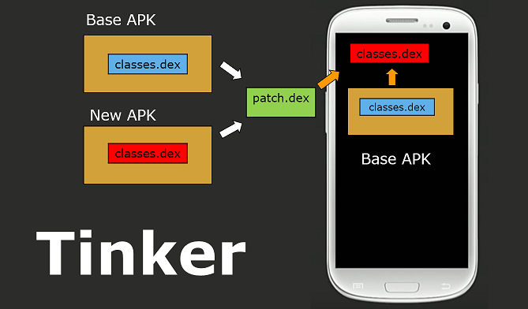

## Tinker
[](https://github.com/Tencent/tinker/blob/master/LICENSE)
[](https://github.com/Tencent/tinker/releases) 
[](https://github.com/Tencent/tinker/pulls)

Tinker is a hot-fix solution library for Android, it supports dex, library and resources update without reinstalling apk.

 

## Getting started
Add tinker-gradle-plugin as a dependency in your main `build.gradle` in the root of your project:

```gradle
buildscript {
    dependencies {
        classpath ('com.tencent.tinker:tinker-patch-gradle-plugin:1.6.2')
    }
}
```

Then you need to "apply" the plugin and add dependencies by adding the following lines to your `app/build.gradle`.

```gradle
dependencies {
    //optional, help to generate the final application 
    compile('com.tencent.tinker:tinker-android-anno:1.6.2')
    //tinker's main Android lib
    compile('com.tencent.tinker:tinker-android-lib:1.6.2') 
}
...
...
apply plugin: 'com.tencent.tinker.patch'
```

If your app has a class that subclasses android.app.Application, then you need to modify that class, and move all its implements to [SampleApplicationLike](https://github.com/Tencent/tinker/blob/master/tinker-sample-android/app/src/main/java/tinker/sample/android/app/SampleApplicationLike.java) rather than Application:

```java
-public class YourApplication extends Application {
+public class SampleApplicationLike extends DefaultApplicationLike {
```

Now you should change your `Application` class, make it a subclass of [TinkerApplication](https://github.com/Tencent/tinker/blob/master/tinker-android/tinker-android-loader/src/main/java/com/tencent/tinker/loader/app/TinkerApplication.java). As you can see from its API, it is an abstract class that does not have a default constructor, so you must define a no-arg constructor:

```java
public class SampleApplication extends TinkerApplication {
    public SampleApplication() {
      super(
        //tinkerFlags, which types is supported
        //dex only, library only, all support
        ShareConstants.TINKER_ENABLE_ALL,
        // This is passed as a string so the shell application does not
        // have a binary dependency on your ApplicationLifeCycle class. 
        "tinker.sample.android.app.SampleApplicationLike");
    }  
}
```

Use `tinker-android-anno` to generate your `Application` is recommended, you just need to add an annotation for your [SampleApplicationLike](https://github.com/Tencent/tinker/blob/master/tinker-sample-android/app/src/main/java/tinker/sample/android/app/SampleApplicationLike.java) class

```java
@DefaultLifeCycle(
application = "tinker.sample.android.app.SampleApplication",             //application name to generate
flags = ShareConstants.TINKER_ENABLE_ALL)                                //tinkerFlags above
public class SampleApplicationLike extends DefaultApplicationLike 
```

How to install tinker? learn more at the sample [SampleApplicationLike](https://github.com/Tencent/tinker/blob/master/tinker-sample-android/app/src/main/java/tinker/sample/android/app/SampleApplicationLike.java).

For proguard, we have already made the proguard config automatic, and tinker will also generate the multiDex keep proguard file for you.

For more tinker configurations, learn more at the sample [app/build.gradle](https://github.com/Tencent/tinker/blob/master/tinker-sample-android/app/build.gradle).

## Known Issues
There are some issues which Tinker can't dynamic update.

1. Can't update AndroidManifest.xml, such as add Android Component.
2. Do not support some Samsung models with os version android-21.
3. Due to Google Play Developer Distribution Agreement, we can't dynamic update our apk.

## Support
Any problem?

1. Learn more from [tinker-sample-android](https://github.com/Tencent/tinker/tree/master/tinker-sample-android).
2. Read the [source code](https://github.com/Tencent/tinker/tree/master).
3. Read the [wiki](https://github.com/Tencent/tinker/wiki) or [FAQ](https://github.com/Tencent/tinker/wiki/Tinker-%E5%B8%B8%E8%A7%81%E9%97%AE%E9%A2%98) for help.
4. Contact us for help.

## Contributing
For more information about contributing issues or pull requests, see our [Tinker Contributing Guide](https://github.com/Tencent/tinker/blob/master/CONTRIBUTING.md).

## License
Tinker is under the BSD license. See the [LICENSE](https://github.com/Tencent/tinker/blob/master/LICENSE) file for details.
